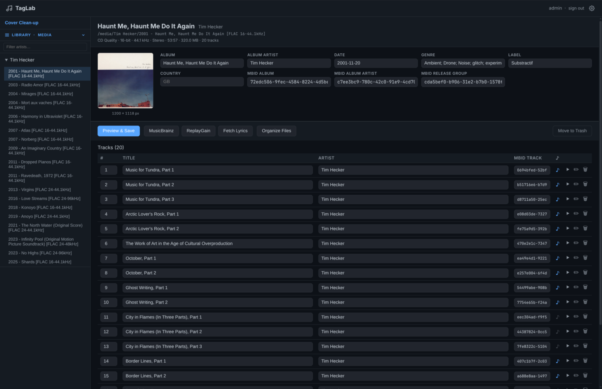
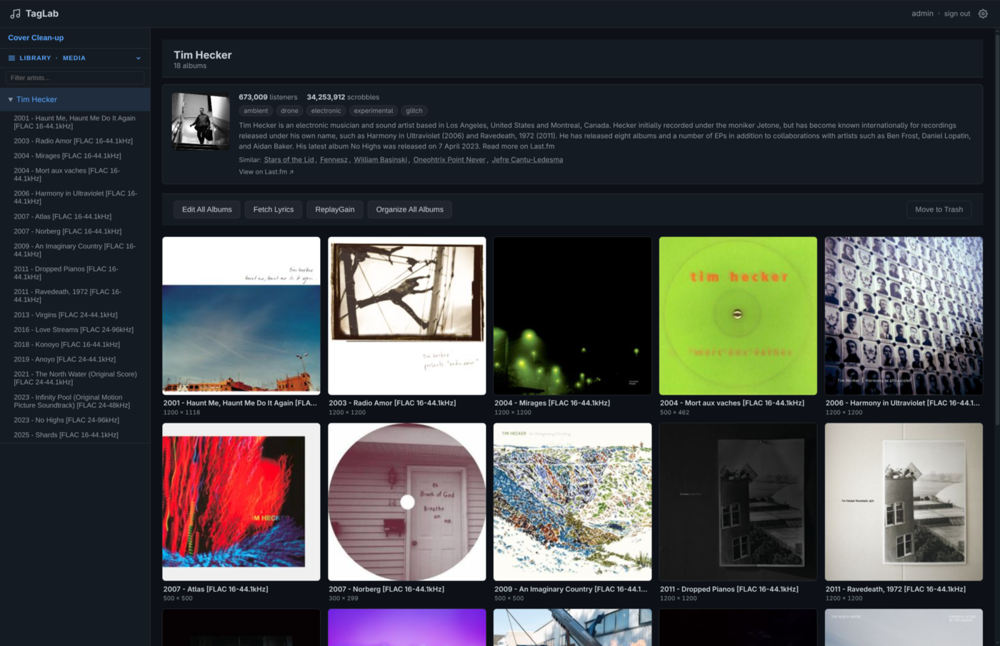
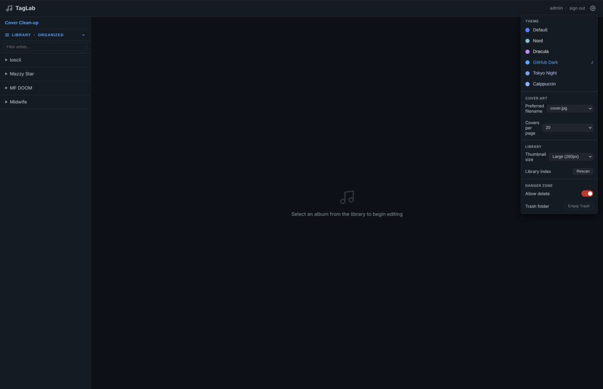

# TagLab

A web-based FLAC metadata editor built for headless media servers. Tag albums,
manage cover art, calculate ReplayGain, pull metadata from MusicBrainz, and
trigger a Navidrome rescan. Runs entirely in the browser.

Inspired by [metadata-remote](https://github.com/wow-signal-dev/metadata-remote).

---

## Features

- Browse your music library by artist and album
- Edit shared album tags (album artist, year, genre, label, country,
  MusicBrainz IDs) and per-track tags in one view
- Bulk-apply shared fields across all tracks in an album
- Upload, replace, or delete cover art, with a dedicated cleanup view for
  albums missing artwork; sort by size to find low-resolution covers
- Artist info page with bio, stats, similar artists, and artist photo via
  Last.fm; artist photo auto-saves to disk on first visit
- Multi-library support: configure multiple music libraries and switch between
  them at runtime
- ReplayGain calculation via ffmpeg EBU R128 (album and track gain, preview
  before writing)
- MusicBrainz lookup to auto-fill metadata from a release search
- Synchronized lyrics support via LRCLib
- File organizer: rename and move files into a consistent folder structure
  based on tags, with server-side saved patterns
- Move to Trash: safely delete albums or individual tracks (moved to
  `.trash/` inside your media root, not permanently removed); dedicated
  Trash page for bulk recovery by track, album, or artist
- Navidrome integration: sync play counts, favorites (♥), and star ratings
  (1–5) from Navidrome; filter and sort the library explorer by those values;
  trigger a full or incremental library rescan
- SQLite-backed library index for fast browsing of large collections; Reset &
  Rescan option wipes the cache and rebuilds from scratch
- Six built-in dark themes (Default, Nord, Dracula, GitHub Dark, Tokyo Night,
  Catppuccin Mocha)
- In-app Help page covering every feature
- Login page with persistent cookie-based sessions; HTTP Basic auth also
  supported for API access

---

## Screenshots







---

## Requirements

TagLab requires either Docker (recommended) or Python 3.12+ with ffmpeg on
your PATH. ffmpeg is required for ReplayGain calculation in both setups.

---

## Installation

### Option A: Docker (recommended)

Docker is the easiest way to run TagLab. ffmpeg is bundled in the image, so
you don't need to install anything beyond Docker itself.

**Using docker compose:**

```bash
git clone https://github.com/cdeschenes/taglab.git
cd taglab
cp .env.example .env
# Edit .env: set HOST_MEDIA_PATH, AUTH_USER, AUTH_PASSWORD, and SECRET_KEY
docker compose up -d
```

Then open `http://localhost:8080`.

**Using `docker run` directly:**

```bash
docker build -t taglab .
docker run -d \
  -p 8080:8080 \
  -v /path/to/your/music:/media \
  -v /path/to/cache:/cache \
  -e MEDIA_PATH=/media \
  -e CACHE_PATH=/cache \
  -e AUTH_USER=admin \
  -e AUTH_PASSWORD=yourpassword \
  -e SECRET_KEY=your-secret-key \
  taglab
```

> **Note:** When using `docker run`, set `MEDIA_PATH` to `/media` (the path
> inside the container). Your music is always mounted at `/media` regardless
> of where it lives on the host.

### Option B: Local (no Docker)

Running locally requires Python 3.12+ and ffmpeg on your PATH.

```bash
git clone https://github.com/cdeschenes/taglab.git
cd taglab

# Install Python deps and download frontend libraries (htmx, Alpine.js)
make setup-dev

# Copy and edit the env file
cp .env.example .env

# Start the dev server with auto-reload
make dev
```

The app runs at `http://localhost:8080`.

### Running tests

```bash
make test

# With coverage report
make test-cov
```

---

## Updating

### Docker Compose

Pull the latest image and recreate the container:

```bash
docker compose pull
docker compose up -d
```

### Local Development

Pull the latest code and sync dependencies:

```bash
git pull
pip install -r requirements.txt
```

---

## Configuration

Copy `.env.example` to `.env` and edit it. `HOST_MEDIA_PATH` (Docker) or
`MEDIA_PATH` (local), `AUTH_USER`, `AUTH_PASSWORD`, and `SECRET_KEY` are the
only settings you must change. Everything else is optional.

| Variable | Default | Description |
|---|---|---|
| `HOST_MEDIA_PATH` | *(required for Docker)* | Host path to your music library, mounted to `/media` inside the container |
| `MEDIA_PATH` | `/media` | Path to music inside the container. Override only for local dev (no Docker). |
| `CACHE_PATH` | `/cache` | Path where the SQLite index and thumbnail cache are stored. Point to a writable volume when media is read-only. |
| `LIBRARIES` | *(empty)* | Comma-separated list of `/path:Label` pairs for multi-library mode. Example: `/media:Main,/media2:Classical`. Leave empty to use `HOST_MEDIA_PATH` as a single library. |
| `AUTH_USER` | `admin` | Login username |
| `AUTH_PASSWORD` | `changeme` | Login password |
| `SECRET_KEY` | *(insecure default)* | Secret used to sign session cookies. Set this to a long random string in production. |
| `ORGANIZE_TARGET` | *(disabled)* | Root path files are moved to when using the organizer. Leave empty to disable. |
| `ORGANIZE_PATTERN` | `{album_artist}/{album}/{track:02d} - {title}.flac` | Filename pattern for the organizer. Tokens: `{album_artist}` `{album}` `{title}` `{track}` `{disc}` `{year}` `{genre}` |
| `ORGANIZE_CLEANUP_PATTERNS` | `._*,*.bak,.DS_Store,Thumbs.db` | Comma-separated glob patterns deleted from source directories after a move. Set to empty to disable cleanup. |
| `NAVIDROME_URL` | *(disabled)* | Navidrome base URL. Enables the Navidrome sync and rescan buttons, and unlocks explorer filters for favorites and star ratings. Leave empty to disable. |
| `NAVIDROME_USER` | | Navidrome username |
| `NAVIDROME_PASSWORD` | | Navidrome password |
| `LASTFM_API_KEY` | *(disabled)* | Last.fm API key. Enables the artist info page (bio, stats, similar artists, artist photo). Get a free key at [last.fm/api](https://www.last.fm/api/account/create). |
| `ALLOW_DELETE` | `false` | Enables Move to Trash. Albums and tracks are moved to `.trash/` inside `MEDIA_PATH`. Use **Empty Trash** in the settings panel to purge permanently. |

---

## Notes

### File organizer

The organizer moves files on disk. Always review the preview before
confirming. Files move to `ORGANIZE_TARGET/<pattern>`. The target directory
must be writable by the container user. The feature is disabled by default;
set `ORGANIZE_TARGET` to enable it.

### Move to Trash

When `ALLOW_DELETE=true`, a **Move to Trash** button appears on the album
editor and a trash icon appears on each track row. Items move to
`{MEDIA_PATH}/.trash/` preserving their relative path. Nothing is permanently
lost until you choose **Empty Trash** in the settings panel. The library index
updates immediately so the sidebar reflects the change without a rescan.

---

## Stack

Python and FastAPI on the backend, with Mutagen for tag reading and writing.
Frontend uses HTMX, Alpine.js, and Jinja2 templates. ReplayGain via ffmpeg's
ebur128 filter. MusicBrainz lookups via musicbrainzngs. Lyrics from LRCLib.
Navidrome integration via the Subsonic API. Library index in SQLite with
mtime-based incremental scanning. Docker base image is Python 3.12 slim.

---

## License

MIT
