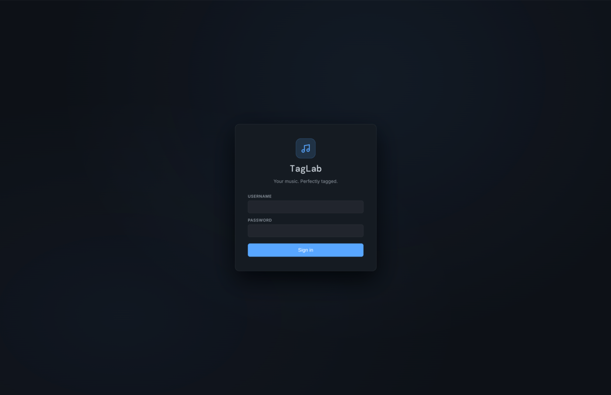
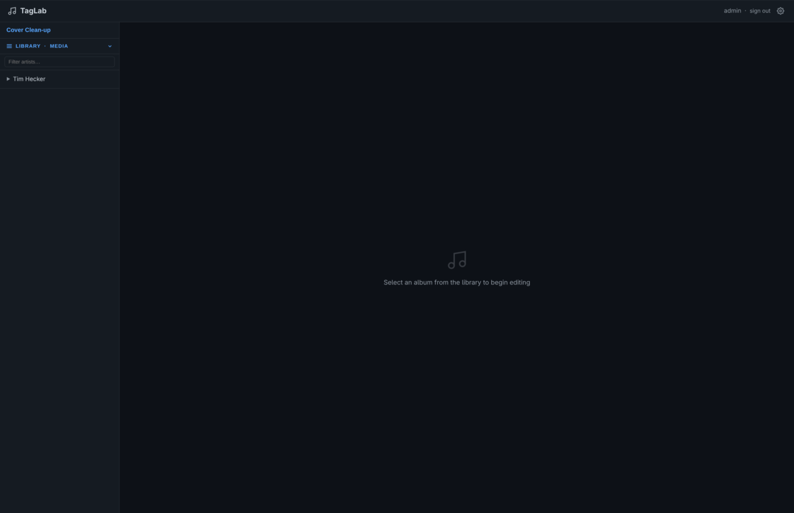
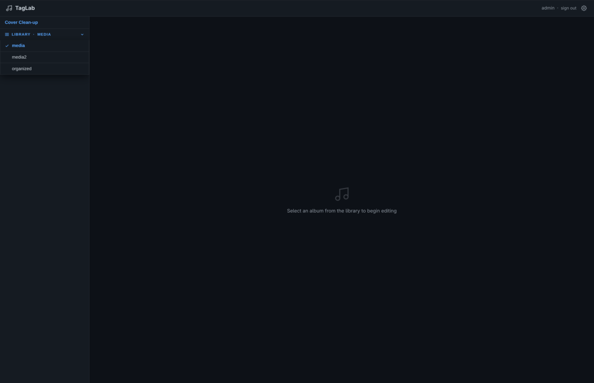
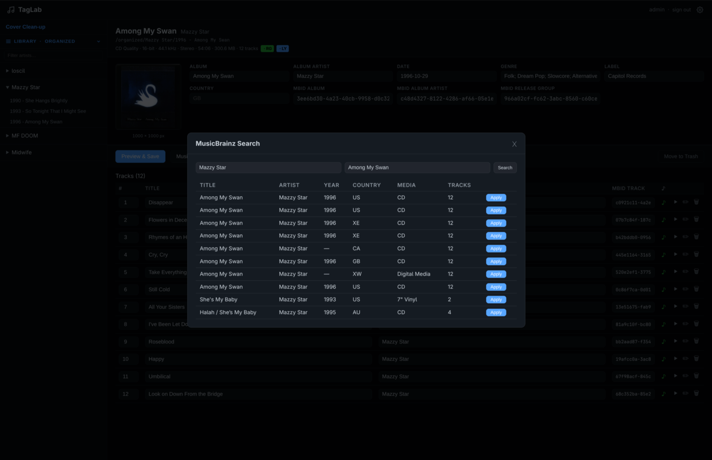
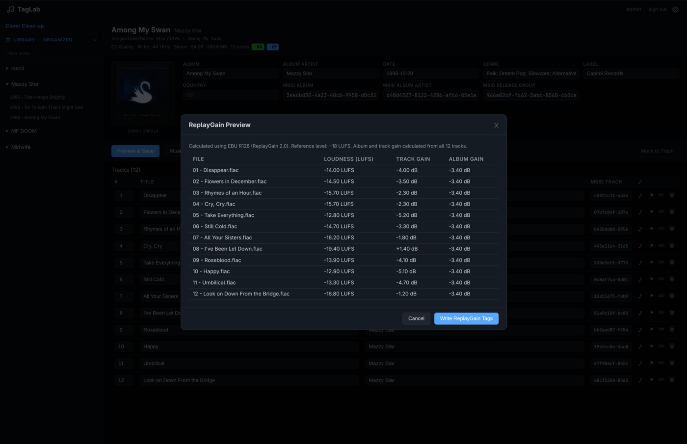
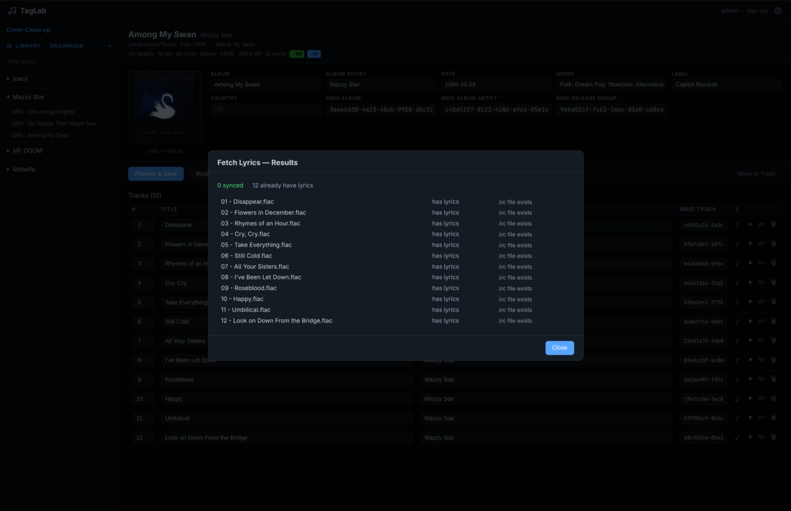
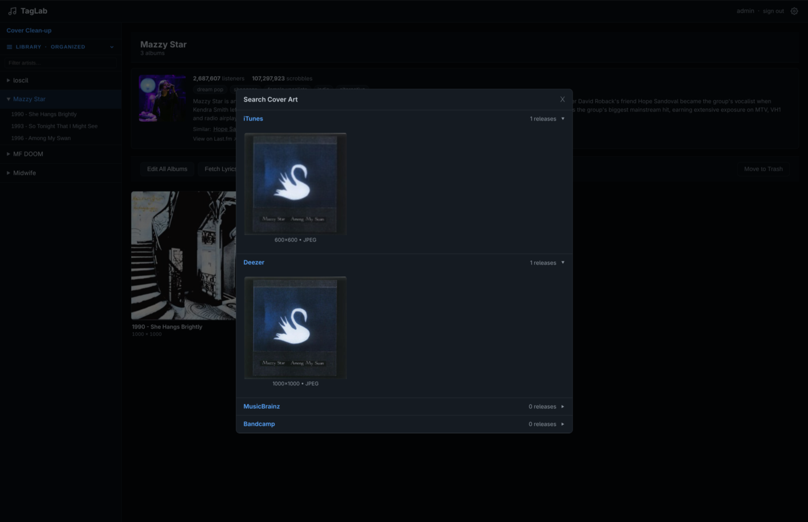

# TagLab user guide

A practical reference for every feature in TagLab. Start with
**Getting started** if this is your first time, or jump to any section
you need.

---

## Getting started

TagLab runs entirely in the browser. No desktop app is needed.

### First launch

Open TagLab at `http://localhost:8080`. You'll land on the login page.
Enter the `AUTH_USER` and `AUTH_PASSWORD` values you set in `.env`. The
session persists via a signed cookie, so you won't need to log in again
unless the cookie expires or you clear it.



### Library scan

On startup, TagLab runs a background scan that indexes your music files
into a SQLite database. The sidebar shows a progress bar while the scan
runs. Browsing works immediately. Albums already indexed appear, and new ones
show up as the scan progresses.

Large libraries (tens of thousands of tracks) can take a minute or two
on the first run. Subsequent startups use mtime-based incremental
scanning, so only changed files are re-indexed.

You can trigger a manual rescan any time from the **Settings** panel
(gear icon in the sidebar).

---

## Navigating the library

The sidebar is your main navigation tool. It lists every artist in your
library.



### Sidebar

Click an artist name to expand their album list. Click an album to open
the Album Editor.

### Filter bar

Type in the filter box at the top of the sidebar to narrow artists and
albums by name. The filter is case-insensitive and matches anywhere in
the name.

### Library switcher

If you've configured multiple libraries, a dropdown at the top of the
sidebar lets you switch between them. Switching reloads the sidebar with
the selected library's content. See
[Multi-library support](#multi-library-support) for setup instructions.



---

## Album Editor

The Album Editor is the main workspace for tagging. It opens when you
click an album in the sidebar.


### Shared tags

At the top of the editor, a row of fields applies to every track in the
album. Changes to shared fields overwrite each track's existing value for
that field — leave a field blank to leave tracks unchanged.

| Field | Description |
|---|---|
| Album | Album title |
| Album Artist | Artist name used for sorting and folder structure |
| Year | Release year (4-digit) |
| Genre | Genre string |
| Label | Record label |
| Country | Country of release |
| MusicBrainz Album ID | MusicBrainz release MBID |
| MusicBrainz Artist ID | MusicBrainz artist MBID |

### Track table

Below the shared fields, each track appears as a row with its number,
title, artist, and duration. From each row you can:

- Click the title to edit it inline.
- Click the **play icon** to stream the FLAC in the browser's built-in
  audio player.
- Click the **pencil icon** to open the full Track Editor for that file.
- Click the **trash icon** to move the track to trash (requires
  `ALLOW_DELETE=true`).

Drag tracks to reorder them. Track numbers update automatically.

### Cover art

The cover art panel sits on the right side of the editor. Available
options:

- **Upload** — drag a file onto the cover area or click to open a file
  picker. Accepts JPEG and PNG.
- **Search** — opens a modal that searches MusicBrainz, Last.fm, and
  Cover Art Archive for available covers. Results are grouped by source
  and include dimensions and file format. Click a cover to apply it.
- **URL** — paste a direct image URL to fetch and embed the cover.
- **Remove** — strips the cover from all tracks in the album.

### Preview and save

Click **Preview** to review a diff of all pending changes before writing
to disk. The preview shows which fields will change and on which files.
Click **Save** to write — changes are applied to the FLAC tags via
Mutagen. There's no undo, so always preview before saving.

---

## Track Editor

The Track Editor gives you access to every supported tag on a single
file. Open it by clicking the pencil icon on any track row in the Album
Editor.

### Available fields

All standard FLAC Vorbis comment tags are editable:

- Title, Artist, Album, Album Artist
- Track number, Disc number
- Year, Genre, Label, Country
- Composer, Conductor, Comment
- MusicBrainz Track ID, Album ID, Artist ID, Release Group ID
- Lyrics (plain text or synchronized LRC format)
- Custom fields — add any arbitrary tag key/value pair

### Fetching lyrics

At the bottom of the Track Editor, click **Fetch Lyrics** to query
LRCLib for synchronized (timed) lyrics. If a match is found, the lyrics
field is populated with the LRC-formatted text. Click **Save** to write
it to the `LYRICS` tag.

---

## Artist Page

The Artist Page shows a summary of one artist along with all their
albums. Open it by clicking an artist name (not an album) in the sidebar.


### Last.fm card

If `LASTFM_API_KEY` is configured, the top of the page shows the
following information from Last.fm:

- Artist photo
- Listener count and total play count
- Genre tags
- A short biography excerpt
- Similar artists (clickable — each one navigates to their artist page)

Without a Last.fm key, this section is hidden.

### Album grid

Below the Last.fm card, all albums by this artist appear as a grid of
cover art thumbnails. Click an album cover to open the Album Editor.

### Bulk actions

Click **Calculate ReplayGain** on the Artist Page to queue every album
by this artist for ReplayGain calculation. Progress is shown per album.

---

## MusicBrainz lookup

MusicBrainz lets you pull accurate metadata — track titles, track order,
year, label, country, and MBIDs — from the MusicBrainz database and
apply it to an album in one step.

### Running a search

In the Album Editor, click **MusicBrainz**. A search form appears
pre-filled with the current album title and album artist. Adjust the
search terms if needed, then click **Search**.

Results list the release date, label, country, and track count. Click a
result to load the full release details.

### Applying metadata

After selecting a release, you'll see a mapping of MusicBrainz tracks to
your local files. Confirm the mapping and click **Apply**. This populates
the Album Editor's shared fields and per-track titles with the
MusicBrainz data. Nothing is written to disk until you click **Save** in
the Album Editor.



---

## ReplayGain

ReplayGain normalizes loudness across your library so tracks play at a
consistent volume. TagLab calculates gain values using ffmpeg's EBU R128
filter.

### Calculate

In the Album Editor, click **ReplayGain**. TagLab runs ffmpeg across all
tracks in the album and computes:

- Track gain and peak for each file
- Album gain and peak for the whole album

Calculation runs in real time. The result is a preview — nothing is
written yet.

### Preview

After calculation, the gain values are displayed for review. If a value
looks wrong (for example, a track is much louder than the rest), you can
cancel and investigate the file before writing.



### Apply

Click **Apply ReplayGain** to write the `REPLAYGAIN_TRACK_GAIN`,
`REPLAYGAIN_TRACK_PEAK`, `REPLAYGAIN_ALBUM_GAIN`, and
`REPLAYGAIN_ALBUM_PEAK` tags to every track in the album.

---

## Lyrics

TagLab fetches synchronized lyrics from LRCLib and stores them in the
`LYRICS` tag. You can fetch lyrics one track at a time or for an entire
album at once.

### Single track

In the Track Editor, click **Fetch Lyrics** to search LRCLib for
synchronized lyrics for that track. The result appears in the lyrics text
area. Click **Save** to write it to the file.

### Bulk fetch

In the Album Editor, click **Fetch Lyrics** to run LRCLib queries for
every track in the album at once. Tracks where lyrics are found are
updated. Tracks where no match is found are skipped — their existing
lyrics (if any) are unchanged.



### LRC format vs. plain text

LRCLib returns timestamped (synchronized) lyrics in LRC format when
available. These are stored as-is in the `LYRICS` tag. Media players that
support LRC (for example, Navidrome) display them with scrolling sync. If
only plain lyrics are available, those are stored instead.

---

## File Organizer

The File Organizer renames and moves your FLAC files into a consistent
directory structure based on their tags. The feature is disabled by
default — enable it by setting `ORGANIZE_TARGET` in `.env`.

### Enabling

Set `ORGANIZE_TARGET` in `.env` to a writable path (for example,
`/organized`). Leave it empty to hide the feature entirely.

### Pattern tokens

The folder and filename structure is controlled by `ORGANIZE_PATTERN`.
Available tokens:

| Token | Value |
|---|---|
| `{album_artist}` | Album artist tag (falls back to `artist` if absent) |
| `{album_artist_first}` | First artist from album artist field (splits on ` / `, `\|`, `;`, ` & `, `, `) |
| `{artist}` | Track artist tag |
| `{artistsort}` | Track artist sort name (e.g. `Young, Neil`) |
| `{albumartistsort}` | Album artist sort name |
| `{album}` | Album title |
| `{title}` | Track title |
| `{track}` | Track number (zero-padded to 2 digits) |
| `{track:02d}` | Track number with explicit 2-digit padding |
| `{disc}` | Disc number |
| `{year}` | Release year (4-digit, from `date` or `year` tag) |
| `{date}` | Full release date string (e.g. `2001-09-10`) |
| `{originalyear}` | Original release year (4-digit, from `originaldate`/`originalyear`) |
| `{genre}` | Genre |
| `{label}` | Record label |
| `{composer}` | Composer name |
| `{key}` | Musical key |

**Default pattern:** `{album_artist}/{year} - {album}/{track:02d} - {title}.flac`

**Example result:** `Pink Floyd/1979 - The Wall/01 - In the Flesh.flac`

### Preview

In the Album Editor, click **Organize**. A preview lists each track's
current path and proposed new path. Review it carefully before
proceeding — moves aren't reversible through the UI, though you can
move files back manually.

### Apply

Click **Apply** in the preview to move the files. TagLab updates the
library index immediately so the sidebar reflects the new paths.

### Post-move cleanup

After moving files, TagLab optionally removes junk files left in the
source directory (for example, `.DS_Store` or `Thumbs.db`). Control the
patterns with `ORGANIZE_CLEANUP_PATTERNS` in `.env`.

---

## Cover art cleanup

The Cover Art Cleanup page shows every album in your library, with albums
missing artwork listed first. Open it by clicking the palette icon in the
sidebar.

### Browsing

Albums are paginated. Use the **Previous** and **Next** buttons to move
through pages. The page size is configurable in Settings.

### Adding artwork

Each album card has an **Upload** button and a **Search** button. These
work the same as in the Album Editor: upload a local file, or search
Cover Art Archive, MusicBrainz, and Last.fm for a cover.



---

## Move to Trash

Move to Trash is a safe-delete feature that moves files to a `.trash/`
folder rather than deleting them immediately. Enable it by setting
`ALLOW_DELETE=true` in `.env`.

### Per-track

A trash icon appears on each track row in the Album Editor. Clicking it
moves that single file to `{MEDIA_PATH}/.trash/`, preserving its
relative path.

### Per-album

A **Move Album to Trash** button appears at the bottom of the Album
Editor. This moves every file in the album and removes the album from
the library index.

### Empty Trash

Nothing moved to trash is permanently deleted until you empty it. Open
the **Settings** panel (gear icon) and click **Empty Trash** to
permanently delete everything in the `.trash/` folder.

---

## Navidrome rescan

TagLab can trigger a Navidrome library rescan after you finish tagging,
so your changes appear in Navidrome without waiting for its scheduled
scan.

### Configuration

In `.env`, set these three variables:

```
NAVIDROME_URL=http://navidrome:4533
NAVIDROME_USER=admin
NAVIDROME_PASSWORD=yourpassword
```

Use the internal Docker hostname if TagLab and Navidrome share a Docker
network.

### Triggering a rescan

With Navidrome configured, a **Rescan Navidrome** button appears in the
**Settings** panel. Click it to call the Navidrome Subsonic API and
start a scan. A confirmation message appears when the scan has been
queued.

---

## Settings

Open the **Settings** panel by clicking the gear icon at the bottom of
the sidebar. Settings are saved in the browser's local storage and
persist across sessions.


| Setting | Description |
|---|---|
| Theme | Choose from six dark themes: Default, Nord, Dracula, GitHub Dark, Tokyo Night, Catppuccin Mocha |
| Thumbnail size | Size of album art thumbnails in the sidebar and Artist Page grid |
| Covers per page | Number of albums shown per page on the Cover Art Cleanup page |
| Rescan library | Manually trigger a full library re-index |
| Rescan Navidrome | Trigger a Navidrome library scan (visible only when Navidrome is configured) |
| Empty Trash | Permanently delete everything in `.trash/` (visible only when `ALLOW_DELETE=true`) |

---

## Multi-library support

TagLab can manage multiple separate music libraries and lets you switch
between them at runtime without restarting the container.

### Configuration

In `.env`, set `LIBRARIES` to a comma-separated list of `/path:Label`
pairs:

```
LIBRARIES=/media:Main Library,/media2:Classical
```

Each entry is a container-side path followed by a colon and a display
label. The first entry is the default library loaded on startup. Labels
appear in the library switcher dropdown in the sidebar.

For Docker, mount each library path as a separate volume:

```yaml
volumes:
  - /path/to/main:/media
  - /path/to/classical:/media2
```

### Switching libraries

Click the library name dropdown at the top of the sidebar and select a
library. The sidebar reloads with that library's artists and albums. All features (Album Editor, Artist Page, Organizer, and so on) operate
on the selected library.

Switching is per-session. The active library resets to the first one on
restart.
